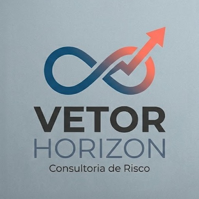

<p align="center">
  
</p>

<h1 align="center">Vetor Horizon — Gestão de Riscos Corporativos</h1>

<p align="center">
  Plataforma de gestão e análise de riscos baseada na <strong>metodologia ICAPT v5</strong>, com quantificação financeira pelos frameworks <strong>FAIR Institute</strong>, <strong>COSO ERM</strong> e <strong>RISK IT (ISACA)</strong>. Estudo de caso <strong>DAMACORP</strong>.
</p>

<p align="center">
  <a href="https://vetor-horizon-risk.netlify.app">
    
  </a>
</p>

<p align="center">
  
  
  
  
  
</p>

---

## Sobre o Projeto

O **Vetor Horizon** é uma plataforma completa de gestão de riscos corporativos que implementa a metodologia **ICAPT (Identificação, Classificação, Avaliação, Priorização e Tratamento)** em sua versão 5 (Aula 06). O aplicativo foi desenvolvido como parte de um estudo de caso acadêmico para a empresa fictícia **DAMACORP**, uma companhia de comércio eletrônico com sede em São Paulo, faturamento de R$ 350 milhões/ano e aproximadamente 1.000 colaboradores.

O sistema gerencia **35 riscos corporativos** (R003 a R037), abrangendo categorias como riscos operacionais, financeiros, tecnológicos, cibernéticos, regulatórios, reputacionais, ambientais e humanos. Cada risco é avaliado com matrizes de **Probabilidade x Impacto (P x I)** e priorizado pela metodologia **GUT (Gravidade, Urgência e Tendência)**, com estratégias de tratamento definidas pelo framework **MATE (Mitigar, Aceitar, Transferir, Evitar)**.

A quantificação financeira de cada risco utiliza os frameworks internacionais **FAIR Institute** (SLE, ARO, ALE), **COSO ERM** (Apetite, Tolerância e Capacidade de Risco) e **RISK IT (ISACA)** (Domínio e Cenário de Risco), permitindo apresentações executivas com valores em R$ para o conselho de administração.

## Funcionalidades

| Tela | Descrição |
|------|-----------|
| **Dashboard** | Fluxo de Risco com 3 matrizes lado a lado (Inerente → Deslocamento → Residual), cards por criticidade, Top 10 GUT, distribuição por tipo e impacto financeiro consolidado |
| **Riscos** | Catálogo completo dos 35 riscos com busca, filtros por criticidade e detalhamento individual com todos os campos ICAPT v5, controles, KRI e impacto financeiro |
| **Evolução** | Comparativo entre 4 versões (Aula 03 → 04 → 05 → 06) com timeline visual, modos Resumo/Comparativo/Matrizes e seletor de período |
| **Estratégico** | Análise estratégica com distribuição por tipo, estratégias MATE, TPRM, investimentos preventivos priorizados por ROI e impacto financeiro por risco |
| **Relatório Executivo** | Apresentação com 10 slides seguindo o roteiro 10-20-30, com panorama de riscos, impacto financeiro FAIR, governança COSO/RISK IT, investimentos preventivos e próximos passos |
| **Tabelas** | Tabelas de referência ICAPT v5: Impacto detalhado (6 dimensões), critérios GUT, níveis de probabilidade e faixas de classificação |
| **Sobre** | Informações do estudo de caso, metodologia ICAPT, estatísticas, equipe de consultores e tutorial interativo |

## Frameworks de Quantificação Financeira

| Framework | Aplicação no Projeto |
|-----------|---------------------|
| **FAIR Institute** | SLE (Single Loss Expectancy), ARO (Annualized Rate of Occurrence) e ALE (Annualized Loss Expectancy) para cada risco |
| **COSO ERM** | Apetite de Risco (limite aceitável), Tolerância (variação aceitável) e Capacidade de Risco (limite máximo) em R$ |
| **RISK IT (ISACA)** | Domínio de Risco (Governança, Avaliação, Resposta) e Cenário de Risco por tipo |

## Wizard Interativo por Menu

Cada menu do aplicativo possui um **wizard tutorial** que é ativado automaticamente na primeira visita. O wizard explica o propósito da tela, suas funcionalidades e dicas de uso. Na tela "Sobre", é possível reabrir o tutorial de qualquer menu a qualquer momento.

## Metodologia ICAPT

A metodologia ICAPT é um framework estruturado para gestão de riscos corporativos, composto por 5 etapas sequenciais:

1. **Identificação** — Identificar fontes de risco (internas e externas), ameaças e descrever o risco na Forma 3
2. **Classificação** — Classificar como estratégico (SIM/NÃO) e definir o tipo de risco conforme taxonomia
3. **Avaliação** — Avaliar Probabilidade (1-5) x Impacto (1-5) = Risco Inerente (1-25)
4. **Priorização** — Priorizar com GUT: Gravidade x Urgência x Tendência (1-125)
5. **Tratamento** — Definir estratégia MATE (Mitigar, Aceitar, Transferir, Evitar), controles e KRIs

### Normas de Referência

| Norma | Aplicação |
|-------|-----------|
| **ISO 31000** | Gestão de riscos — Diretrizes |
| **ISO 27001** | Segurança da informação |
| **ISO 22301** | Continuidade de negócios |
| **ISO 45000** | Saúde e segurança ocupacional |

## Estudo de Caso — DAMACORP

| Atributo | Valor |
|----------|-------|
| **Nome** | DAMACORP |
| **Setor** | Comércio Eletrônico |
| **Sede** | São Paulo – SP |
| **Unidades** | Barueri (SP), Rio de Janeiro (RJ), Curitiba (PR) |
| **Funcionários** | ~1.000 colaboradores |
| **Faturamento** | R$ 350 milhões/ano |
| **Operação** | 24/7, 365 dias/ano |
| **Cadeia de Valor** | E-commerce B2C e B2B, logística integrada, 3 centros de distribuição |

## Tecnologias

| Tecnologia | Versão | Finalidade |
|------------|--------|------------|
| Expo SDK | 54 | Framework mobile multiplataforma |
| React Native | 0.81 | Interface nativa iOS/Android/Web |
| TypeScript | 5.9 | Tipagem estática |
| NativeWind | 4 | Tailwind CSS para React Native |
| Expo Router | 6 | Navegação baseada em arquivos |
| Reanimated | 4.x | Animações nativas |
| tRPC | 11.x | API type-safe |
| Vitest | 2.x | Testes unitários |

## Estrutura do Projeto

```
vetor-horizon-risk/
├── app/                        # Telas do aplicativo (Expo Router)
│   ├── (tabs)/                 # Navegação por abas
│   │   ├── index.tsx           # Dashboard (3 matrizes em fluxo)
│   │   ├── risks.tsx           # Catálogo de Riscos
│   │   ├── evolution.tsx       # Evolução entre Aulas
│   │   ├── strategic.tsx       # Análise Estratégica
│   │   ├── report.tsx          # Relatório Executivo (10 slides)
│   │   ├── tables.tsx          # Tabelas de Referência
│   │   └── settings.tsx        # Sobre o Projeto
│   ├── risk/[id].tsx           # Detalhe do Risco
│   └── risk/new.tsx            # Cadastro de Novo Risco
├── assets/images/              # Ícones, logo e splash
├── components/                 # Componentes reutilizáveis
│   ├── wizard-overlay.tsx      # Wizard tutorial por menu
│   ├── web-layout.tsx          # Layout desktop com sidebar
│   └── ui/                     # Componentes UI (GlowCard, PulsingBadge, etc.)
├── data/                       # Planilha Excel fonte dos dados
├── hooks/                      # React hooks customizados
├── lib/                        # Lógica principal
│   ├── models.ts               # Tipos, interfaces e tabelas ICAPT
│   ├── financial-data.ts       # Dados financeiros FAIR/COSO/RISK IT
│   ├── evolution-data.ts       # Dados das 4 aulas (03, 04, 05, 06)
│   ├── risk-context.tsx        # Contexto global de riscos
│   └── trpc.ts                 # Cliente API
├── server/                     # Backend (tRPC + Express)
├── scripts/                    # Scripts utilitários
├── netlify.toml                # Configuração de deploy Netlify
└── package.json
```

## Como Executar Localmente

### Pré-requisitos

- [Node.js](https://nodejs.org/) 22+
- [pnpm](https://pnpm.io/) 9+

### Instalação

```bash
# Clonar o repositório
git clone https://github.com/cristianotutu/vetor-horizon-risk.git
cd vetor-horizon-risk

# Instalar dependências
pnpm install

# Iniciar o servidor de desenvolvimento
pnpm dev
```

O aplicativo estará disponível em `http://localhost:8081` (versão web).

### Executar no celular

```bash
# Gerar QR code para Expo Go
pnpm qr
```

Escaneie o QR code com o aplicativo **Expo Go** (disponível na App Store e Google Play).

## Atualização Automática de Dados

O projeto inclui um script de extração automática que lê a planilha Excel e gera o código TypeScript correspondente:

```bash
# Extrair dados da planilha para TypeScript
pnpm extract
```

O script lê o arquivo `data/VetorHorizon-Grupo5.xlsx` e atualiza automaticamente o `lib/evolution-data.ts` com os riscos extraídos.

### Pipeline de Deploy

Ao fazer push de alterações para o branch `main`, o Netlify detecta automaticamente e executa o build, publicando a versão atualizada em [vetor-horizon-risk.netlify.app](https://vetor-horizon-risk.netlify.app).

## Consultores — Vetor Horizon

Equipe de consultores responsáveis pela análise e gestão de riscos do estudo de caso DAMACORP:

- **Cristiano Siqueira Israel**
- **Danielli Mezavilla Pinto**
- **Karolina Guimarães Negrizolo**
- **Matheus Augusto Arduini**
- **Pedro Ricci Righeti**

## Licença

Este projeto foi desenvolvido para fins acadêmicos como parte do programa de estudos do **IDESP**. Todos os dados da empresa DAMACORP são fictícios e utilizados exclusivamente para fins educacionais.

---

<p align="center">
  <strong>Vetor Horizon</strong> — Consultoria de Risco<br/>
  Estudo de Caso DAMACORP · IDESP
</p>
